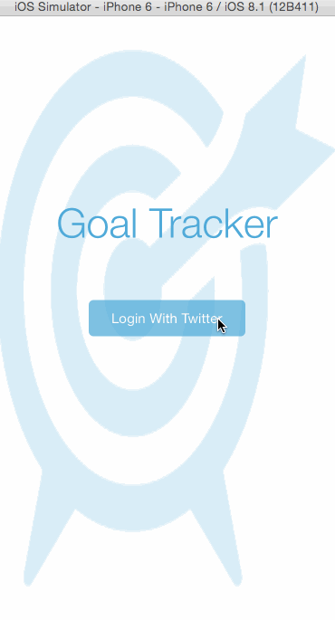

# GoalTraker Demo

This is an iOS Swift demo application. It is a goal tracker applicaiton using the [Parse API](https://parse.com/) as its back-end. 

Features:

 * [x] Twitter login integration
 * [x] Twitter private message notification
 * [x] User data saved in the Parse database
 * [x] Local notification
 * [x] Calendar view with completion marks
 * [x] View Controller transition animations

GIF created with [LiceCap](http://www.cockos.com/licecap/).
